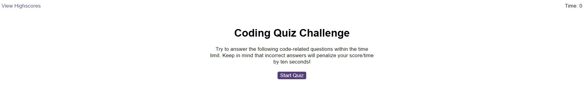
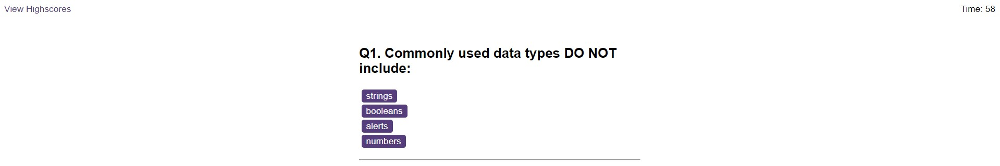
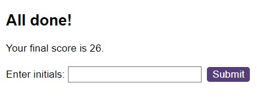
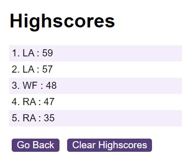

# CodeQuiz
A timed quiz with questions around JavaScript

## Description 

This is a timed quiz with a countdown in the upper right corner, and a highscores page link in the upper left.

## Usage 

To use this website:
- Click on the start quiz button.
- A timer will start and you will get a selection of questions to answer.
- Each incorrect answer will reduce the time by 10 seconds.
- When all questions have been answered, or the time has ran out, you will see you score, and be able to input your name.
- You will then be redirected to the Highscores page, where your name and score will appear if you are in the top 5 scores.
- You can then either clear the score board, or go back to the start screen.

(Walkthrough images below)

 
 
 
 

Link to active website: https://Leanne-Annable.github.io/CodeQuiz

## Credits

I looked up potential solutions on w3schools, stackoverflow and mozilla developer when i encountered issues with my code. 
I used 'favicon.io' to create a personal favicon icon. link - https://favicon.io/favicon-generator/

## License

This webpage is licenced under the MIT Licence

© 2023 edX Boot Camps LLC. Confidential and Proprietary. All Rights Reserved.
